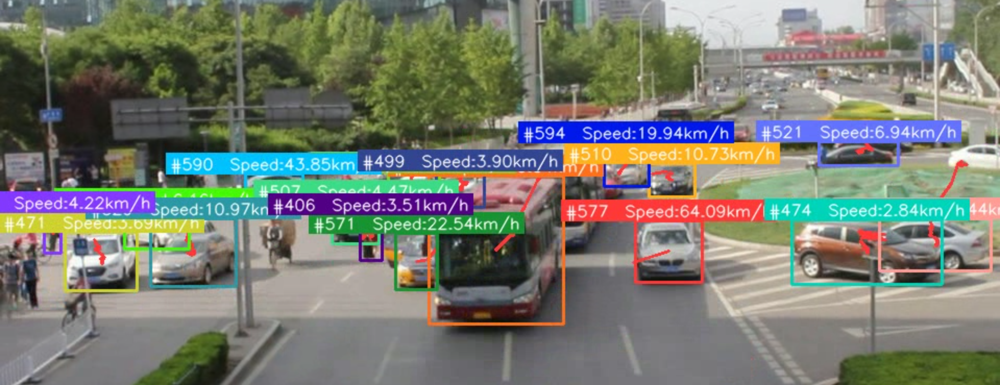

# Traffic Analysis using YOLOv8 and ByteTrack

This script analyzes traffic flow using YOLOv8 for object detection and ByteTrack for efficient online multi-object tracking. It includes:

1. **Vehicle Detection**: Detecting each vehicle at an intersection and drawing bounding boxes around them. The color of each bounding box corresponds to the side of the intersection from which the vehicle entered.
  
2. **Instantaneous Speed Estimation**: Estimating per-object speed from tracking motion and displaying it above each vehicle (speed is a pixel-motion estimate unless you calibrate the scale).
  
3. **Path Outlining**: Tracing the path of each vehicle over the last few seconds.
  
4. **Vehicles' direction Panel**: Depicting the number of cars from each side of the intersection that chose a particular exit.


<br><br>

## How to Run
### Requirements
- Python **3.10+** (tested with 3.11 on Windows)
- A working Python environment where `pip` can install packages

### Quickstart (Windows / PowerShell)
From the project folder:

```bash
python -m venv .venv
.venv\Scripts\activate
pip install -r requirements.txt
python main.py --source_weights_path yolov8n.pt --source_video_path data/raw_val_video.mp4 --target_video_path data/output_speed.mp4 --confidence_threshold 0.3 --iou_threshold 0.5
```

### Quickstart (macOS / Linux)

```bash
python3 -m venv .venv
source .venv/bin/activate
pip install -r requirements.txt
python main.py --source_weights_path yolov8n.pt --source_video_path data/raw_val_video.mp4 --target_video_path data/output_speed.mp4 --confidence_threshold 0.3 --iou_threshold 0.5
```

### Using the provided traffic-analysis weights/video (optional)
If you want to use the included `data/traffic_analysis.pt` and `data/traffic_analysis.mp4`:

```bash
python main.py --source_weights_path data/traffic_analysis.pt --source_video_path data/traffic_analysis.mp4 --target_video_path data/output_speed.mp4 --confidence_threshold 0.3 --iou_threshold 0.5
```

### Output
- The processed output video is written to whatever you pass as `--target_video_path`, e.g. `data/output_speed.mp4`.
- If you omit `--target_video_path`, the script will try to open a preview window (press `q` to quit).

### Notes / Customization
- **Speed values**: speed is computed from tracked pixel motion with a single `scale` constant (meters per pixel). To tune it, edit `scale` in `video_processing/video_processor.py` inside `annotate_frame()`.
- **Direction panel (zones)**: by default the zone polygons are empty (`video_processing/utils.py`). If you want entry/exit counting, define `ZONE_IN_POLYGONS` and `ZONE_OUT_POLYGONS` there.

### Troubleshooting
- **Missing packages / install fails**: make sure you activated the venv (`.venv\Scripts\activate`) before running `pip install -r requirements.txt`.
- **No video output**: verify your input video path exists and is readable (try `python test_video.py`).
